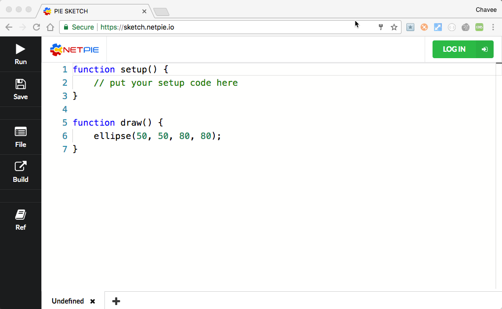

.. netpie documentation master file, created by
   sphinx-quickstart on Thu Sep 21 15:31:21 2017.
   You can adapt this file completely to your liking, but it should at least
   contain the root `toctree` directive.

PieSketch
=========

PieSketch เป็นเครื่องมือช่วยพัฒนา application แบบ web-based ที่ทีมพัฒนา NETPIE ตั้งใจออกแบบขึ้นมา สำหรับผู้ใช้มือใหม่ และมือสมัครเล่น ที่เพิ่งหัดเขียนโปรแกรม ใช้เป็นสนามในการสร้างสรรและแบ่งปันผลงาน Pie Sketch ได้รวมโมดูลต่างๆ ที่รองรับการทำงานกับ ภาพ, เสียง, กราฟฟิคเคลื่อนไหว รวมไปถึงความสามารถในการเชื่อมต่อ NETPIE platform สำหรับออกแบบ IOT application ที่สื่อสารกันบนหน้าจอได้อย่างรวดเร็วและสนุกสนาน

การใช้งาน
--------
บริการของ PieSketch เข้าถึงได้ทาง https://sketch.netpie.io

เริ่มต้นกับ sketch แรก
--------------------

โค้ดของ PieSketch มีพื้นฐานอยู่บน `p5js <https://p5js.org>`_. โครงสร้างประกอบด้วย 2 ฟังก์ชั่นหลัก ได้แก่ setup() ซึ่งจะถูกเรียกครั้งเดียวตอนแรกที่โปรแกรมถูกรัน และ draw() ที่จะถูกเรียกซ้ำๆไปตลอด โค้ดตัวอย่าง

.. raw:: html
   :file: _static/iframe.html