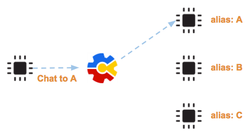

.. raw:: html

	

Message
=======

การสื่อสารภายในกลุ่มของ sketch จะเป็นการรับส่ง message หากัน message คือข้อความอะไรก็ได้ ขึ้นอยู่กับนักพัฒนาจะออกแบบ ลักษณะการส่ง message แบ่งตามจุดหมายปลายทางยของ message แบ่งได้สองแบบ คือ

- message ที่ส่งแบบเจาะจง่ผู้รับ การส่งลักษณะนี้จะใช้ฟังก์ชั่น microgear.chat() 
- message ที่ส่งแบบไม่เจาะจง่ผู้รับ แต่ส่งเข้าหาสิ่งที่เรียกว่า topic การส่งลักษณะนี้จะใช้ฟังก์ชั่น microgear.publish() 

	รูปแสดงการส่ง chat message

