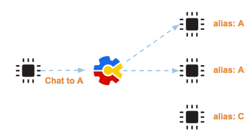
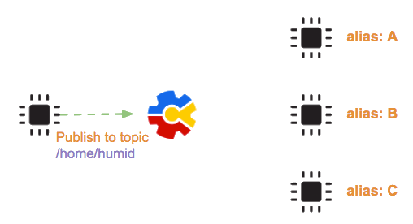
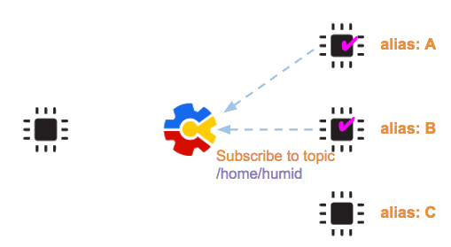
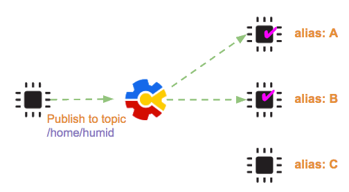
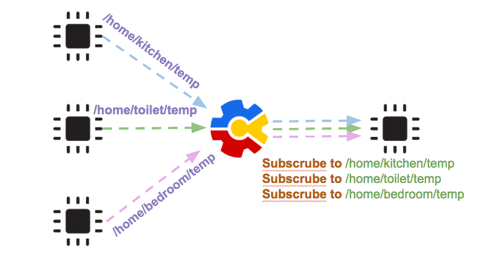
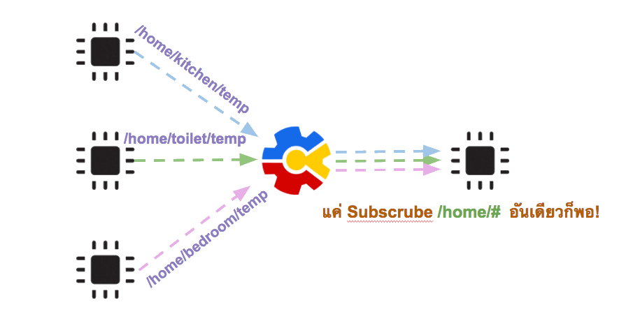
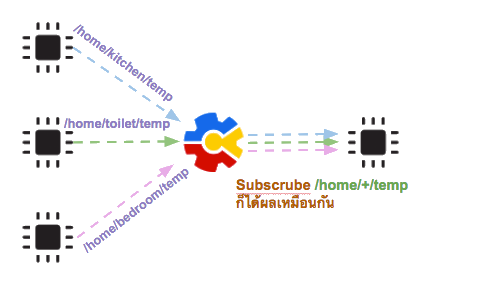

.. raw:: html
	
	
	

.. role:: red
.. role:: green

Message
=======

การใช้งาน NETPIE จะไม่มีความหมายเลย หากไม่มีการสื่อสารระหว่าง microgear เกิดขึ้น การสื่อสารภายในกลุ่มของ microgear บนแต่ละ sketch นั้นเป็นการรับส่ง message ไปมาหากัน message คือข้อความอะไรก็ได้ ขึ้นอยู่กับผู้พัฒนาจะออกแบบ แต่จะต้องเป็นที่เข้าใจกันระหว่าง microgear ด้วยกันเอง เช่น message คำว่า ON ห ลักษณะการส่ง message แบ่งตามจุดหมายปลายทางยของ message แบ่งได้สองแบบ คือ

- message ที่ส่งแบบเจาะจงผู้รับ การส่งลักษณะนี้จะใช้ฟังก์ชั่น microgear.chat() 
- message ที่ส่งแบบไม่เจาะจง่ผู้รับ แต่ส่งเข้าหาสิ่งที่เรียกว่า topic การส่งลักษณะนี้จะใช้ฟังก์ชั่น microgear.publish() 

การส่ง message ด้วย chat()
^^^^^^^^^^^^^^^^^^^^^^^^

ผู้ส่งจะระบุ alias ของผู้รับ message จะไปถึงเฉพาะ sketch ที่ได้ตั้ง alias ตัวเองเป็นชื่อดังกล่าว

.. figure:: _static/chat-01.png
	:align: center

	รูปแสดงการส่ง chat message

หากมี sketch หลายตัวใช้ alias ชื่อเดียวกัน messae ที่ส่งหา alias ชื่อนั้นจะเข้าทั้งสอง sketch ดังภาพ

	รูปแสดงการส่ง chat message ไปยังหลายๆ alias

ในการณีที่เราต้องการส่งข้อมูลชุดเดียว ไปยังหลาย alias พร้อมกัน ก็สามารถ loop ส่งตาม alias ของผู้รับแต่ละรายได้ แต่หากผู้รับมีจำนวนมาก หรือเราไม่ทราบ alias ของผู้รับ ก็อาจจะไม่สะดวกที่จะใ้วิธีนี้ เรามีอีกวิธีในการส่ง message คือการใช้ฟังก์ชั่น publish()

การส่ง message ด้วย publish()
^^^^^^^^^^^^^^^^^^^^^^^^^^^

ในขณะที่ปลายทางของ chat คือ sketch ที่ตั้ง alias ชื่อนั้น จุดหมายปลายทาง publish คือสิ่งที่เรียกว่า topic ในที่นี้ topic คือ string ที่ระบุกลุ่มของความสนใจ โดยมีลักษณะเป็น path เริ่มต้นและคั่นด้วยเครื่องหมาย / เช่น /home/bedroom/temp ผู้ที่จะได้รับ message จะต้องเป็นผู้ที่ได้ทำการ subscribe topic นั้นๆไว้อยู่ก่อนแล้ว แต่ถ้าหากไม่มีใคร subscribe เลย topic นั้นก็จะหายไปเฉยๆ

	รูปแสดงการ publish ไปยัง topic ที่ไม่มีผู้รับ

แต่ถ้าหากมีผู้ subscribe ดังภาพ

	รูปแสดงการ subsribe topic

message ที่ publish หลังจากนั้นก็จะถูกส่งไปถึงผู้ subscribe ทั้งหมด

	รูปแสดงการ publish ไปยัง topic ที่มีผู้ subscribe อยู่

Topic
^^^^^

การใช้ publish กับ subscribe ช่วยลดความเกี่ยวพัันของ component สองฝั่ง กล่าวคือ ผู้ส่งที่มีข้อมูล ก็ทำหน้าที่ส่งอย่างเดียว โดยไม่ต้องสนใจว่าใครรอรับอยู่บ้าง ส่วนฝั่งผู้รับ ก็ต้องดูแลตัวเองด้วยการ subscribe topic ที่สนใจ หากเราออกแบบ topic ดีๆ การจัดการเส้นทางของ message ก็จะทำได้ง่าย โดยปกติแล้วเรามักใช้ topic ที่สื่อความหมายถึงตัว message เช่น ให้ sensor ทำการ publish ข้อมูลอของตัวเอง ซึ่งเป็นุณหภูมิของห้องครัวเข้าไปที่ topic ชื่อ /home/kitchen/temp และ publish ข้อมูลอุณหภูมิของห้องนอนเข้าไปที่ /home/bedroom/temp

หากผู้รับ ต้องการรับ message จากหลายๆ topic การที่จะ subscribe ทั้งหมดทีละ topic และต้องคอยเพิ่ม topic ใหม่อยู่ตลอด ก็อาจจะเป็นความยุ่งยาก วิธีการที่ดีกว่า คือการ subscribe topic เป็นกลุ่มโดยใช้ wildcard   

Wildcard
^^^^^^^^

wildcard เป็นเครื่องหมายแทนคำ หรือประโยค มีอยู่ 2 ชนิด ได้แก่

- เครื่องหมาย + ใช้แทนคำหนึ่งคำ
- เครื่องหมาย # ใช้แทนประโยค

จากตัวอย่างที่แล้ว เราสามารถ subscribe /home/# เพียง topic เดียว ก็จะได้ message ทั้งหมดที่ publish เข้า /home/kitchen/temp , /home/toilet/temp และ /home/bedroom/temp ทั้งนี้เพราะ # ทำหน้าที่แทนได้ทุกคำทุกความยาวที่อยู่หลัง /home

.. attention::
	การใช้ wildcard # ต้องวางที่ท้ายประโยคเท่านั้น

ตัวอย่างเพิ่มเติมการใช้ # หากเรา subscribe topic ชื่อ /home/ground/# เราจะได้รับ message ที่ publish เข้า topic ต่อไปนี้

:green:`✔ /home/ground/kitchen/humid`

:green:`✔ /home/ground/toilet/temp`

:green:`✔ /home/ground/kitchen`

:green:`✔ /home/ground`

:red:`✕ /home/upstairs/bedroom/temp`

ในทำนองเดียวกัน เราสามารถ subscribe /home/+/temp เพื่อรับ message ทั้งหมดที่ publish เข้า /home/kitchen/temp , /home/toilet/temp และ /home/bedroom/temp ได้เหมือนกัน ทั้งนี้เพราะ + ทำหน้าที่แทนได้ทุกคำ

ตัวอย่างเพิ่มเติมการใช้ # หากเรา subscribe topic ชื่อ /home/ground/+/temp เราจะได้รับ message ที่ publish เข้า topic ต่อไปนี้

:green:`✔ /home/ground/kitchen/temp`

:green:`✔ /home/ground/toilet/temp`

:red:`✕ /home/ground/bedroom`

:red:`✕ /home/ground/kitchen/temp/oven`

:red:`✕ /home/upstairs/bedroom/temp`

